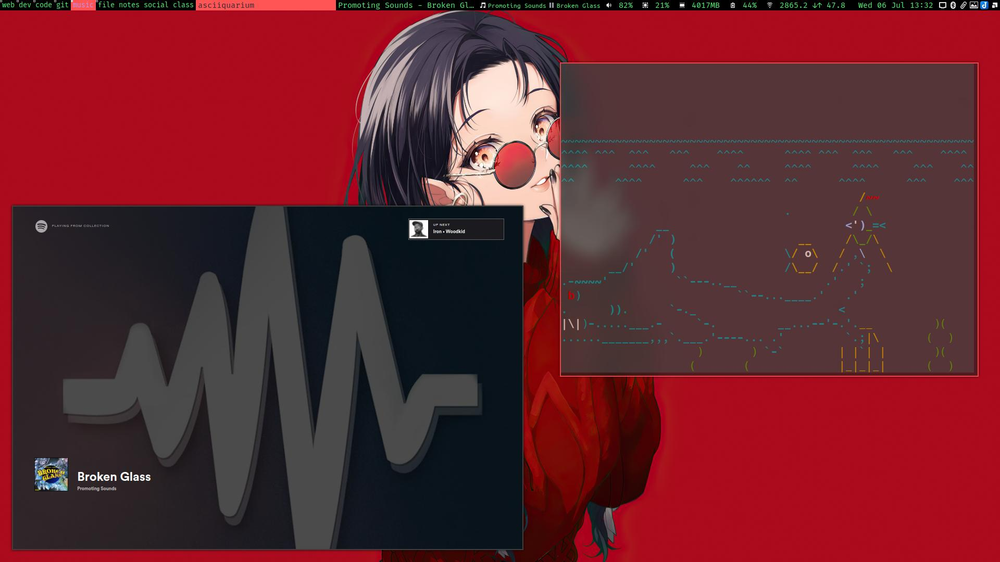

# Awesome WM dofiles
> My Awesome WM config for arch linux
```
        /\         anky@sacred-pc
       /  \        OS:        Arch Linux
      /\   \       KERNEL:    Linux 5.15.51-1-lts
     /  __  \      UPTIME:    1 hour, 11 minutes
    /  (  )  \     PACKAGES:  1677
   / __|  |__\\    SHELL:     zsh
  /.`        `.\   DE:        awesome
```


*I use arch btw*