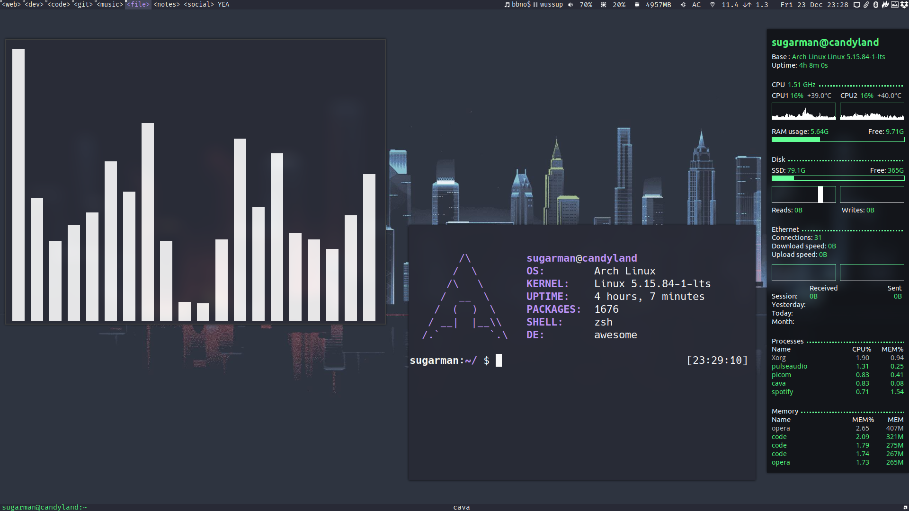

# Awesome WM dofiles
> My Awesome WM config for arch linux
```
        /\         sugarman@candyland
       /  \        OS:        Arch Linux
      /\   \       KERNEL:    Linux 5.15.84-1-lts
     /  __  \      UPTIME:    4 hours, 9 minutes
    /  (  )  \     PACKAGES:  1676
   / __|  |__\\    SHELL:     zsh
  /.`        `.\   DE:        awesome
```


### For Cool widgets visit [streetturtle/awesome-wm-widgets](https://github.com/streetturtle/awesome-wm-widgets)

> Contains 5 Themes

> Go and support @streetturtle